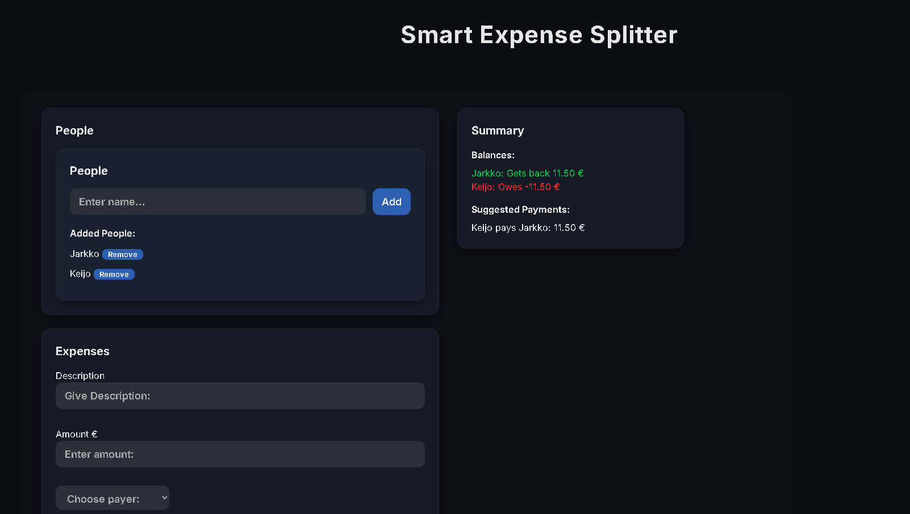

# Smart Expense Splitter 💸

Smart Expense Splitter is a personal React project for splitting shared expenses between people.

What makes it **smart** is that the app not only tracks expenses — it automatically calculates group balances and suggests who should pay whom to settle everything fairly.

This project was built to improve my skills in React, TypeScript, state management, and UI development based on a Figma design.

---

## Live Demo

The application is deployed on Vercel:

🔗 https://smart-expense-splitter-pied.vercel.app/

---

## Preview



---

## ✨ Key Features

- Add and manage people in a group
- Add shared expenses with:
  - Description
  - Amount
  - Payer
  - Participants
- View expense history with delete option
- **Smart balance calculation**
  - Shows who is owed money
  - Shows who needs to pay back
- **Suggested payments**
  - The app suggests the simplest payments between participants  
    (e.g. _“Person pays Me 10€”_)

---

## 📌 About This Project

This application was developed as a personal practice project to learn and improve:

- React component structure
- TypeScript typing
- LocalStorage persistence
- UI styling based on a Figma prototype
- Smart expense settlement logic

---

## 🎨 UI Design (Figma)

The user interface was built based on a Figma prototype:

🔗 https://www.figma.com/design/6aCj2Jr7ICFdUbRcsrr7sQ/Smart-Expense-Splitter-Design

---

## 🛠 Tech Stack

- React + TypeScript
- Vite
- Custom CSS styling based on Figma design
- Tailwind CSS
- LocalStorage for persistent data

---

## 🚀 Getting Started

Install dependencies:

```bash
npm install
```

Run the development server:

```bash
npm run dev
```

Open in browser:

```bash
http://localhost:5173
```
